[](https://classroom.github.com/a/YyUO0xtt)
# COMP2150  - Level Design Document
### Name: Matthew Murphy
### Student number: 47954450 

This document discusses and reflects on the design of your platformer level for the Level Design assessment. It should be 1500 words. Make sure you delete this and all other instructional text throughout the document before checking your word count prior to submission. Hint: You can check word count by copying this text into a Word or Google doc.

Your document must include images. To insert an image into your documentation, place it in the "DocImages" folder in this repo, then place the below text where you want the image to appear:

```

```

Example:


## 1. Player Experience (~700 words)
Outline and justify how your level design facilitates the core player experience goals outlined in the assignment spec. Each section should be supported by specific examples and screenshots of your game encounters that highlight design choices made to facilitate that particular experience.

### 1.1. Discovery
During section 1 of the level the player discovers the staff locked behind a door that they must use to break the pillar blocking the key. When the player encounters the door they are required to make their way up each of the platforms above the staff so that the moveable block can be pushed onto the pressure pad to unlock the door. This encounter teaches the player the principals needed to unlock the gun later in the level, as when the player discovers the door blocking the gun they will already have been introduced to the mechanics required to unlock the door. However, these mechanics will vary from the mechanics introduced to the player before, as the platforms will now move allowing for the player to discover a new mechanic since they have progressed further through the level. This introduction of moving platforms allows for the player to be introduced to new mechanics by using their familiarity of mechanics from section 1 to create newly discovered mechanics that the level is able to build upon based on the players experiences from earlier sections in the level.

Section 1:

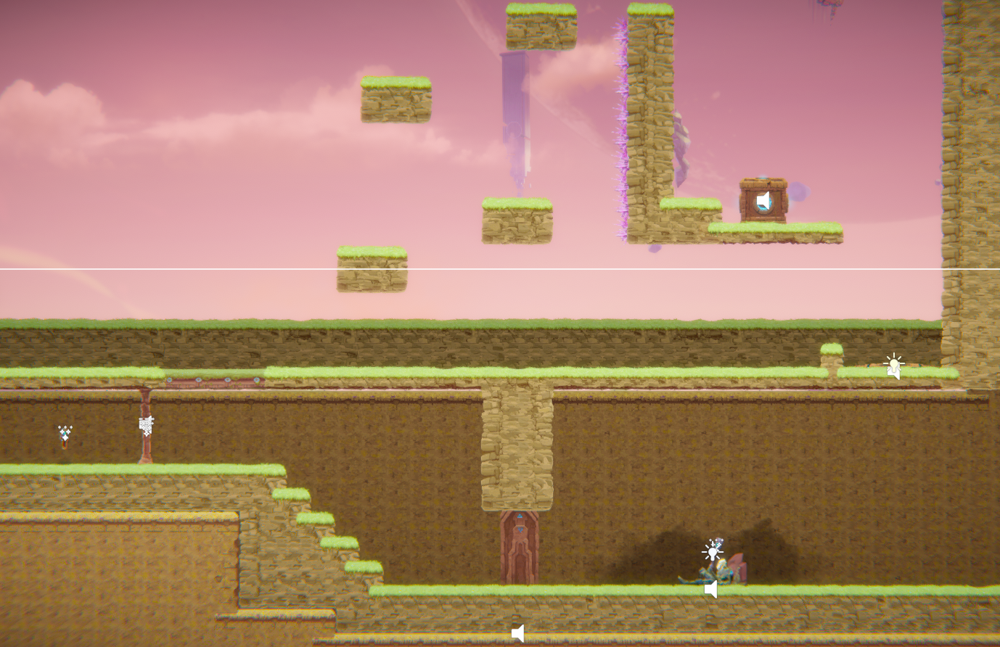

Gun example:

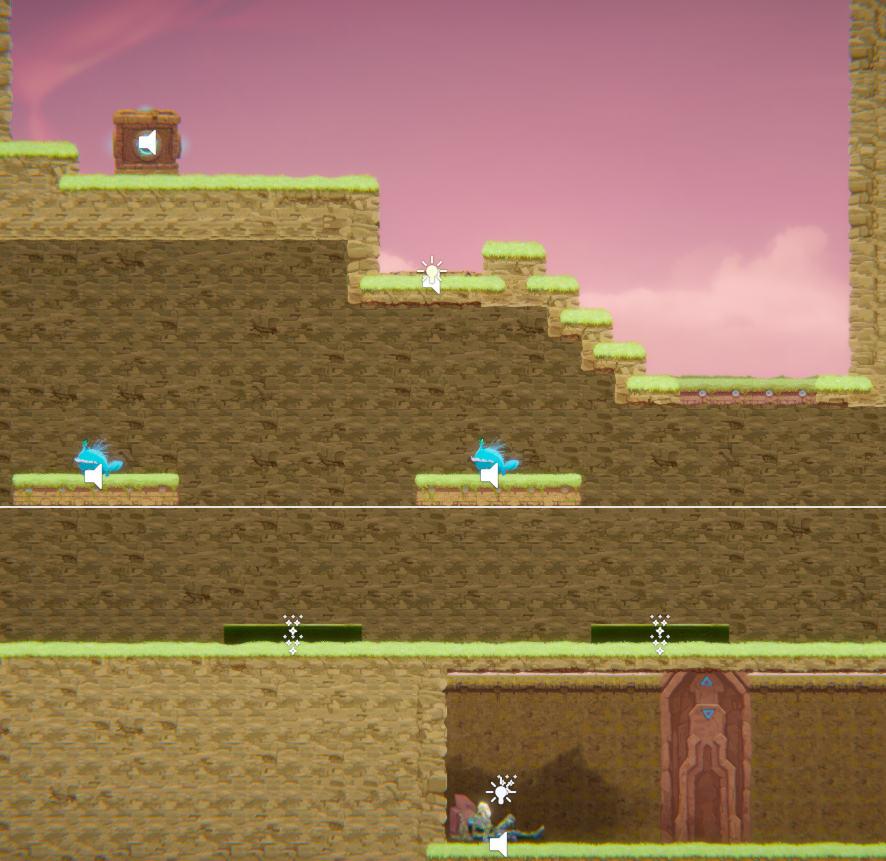


### 1.2. Drama
The intensity curve of the level fluctuates multiple times throughout the level with it changing based on the intensity of the interaction that the player has just faced, for example in section 1 after the player has cleared the area where they must jump over the spiked blocks while trying not to fall into the acid below them, the player is presented with a puzzle to solve afterward. This modulates the intensity of the level as the player goes from an area with a large amount of tension where they can fall into acid with a single wrong jump to an area where this tension is then relieved with a puzzle that does not put the player in a likely situation of death. By modulating the intensity of the level multiple times as the player progresses through it, it allows for the player to reflect on the tension and intensity that they have just experienced in the previous area before the tension and intensity of the level increases again when the player proceeds to the next area.

Tension to Relief:

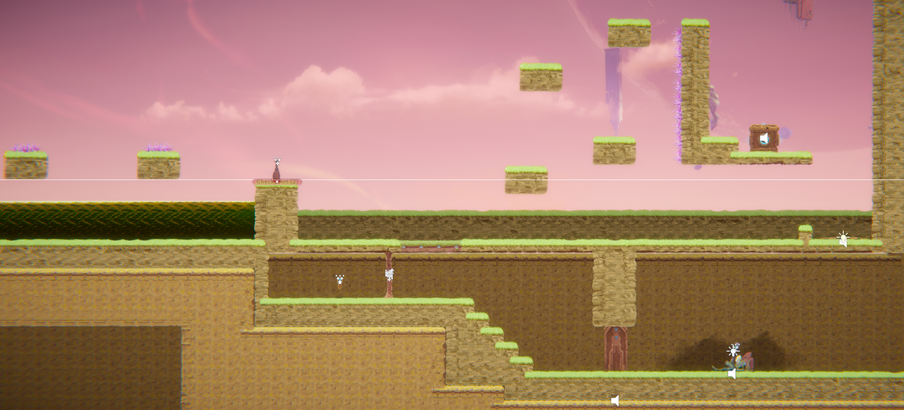

Relief back to Tension:

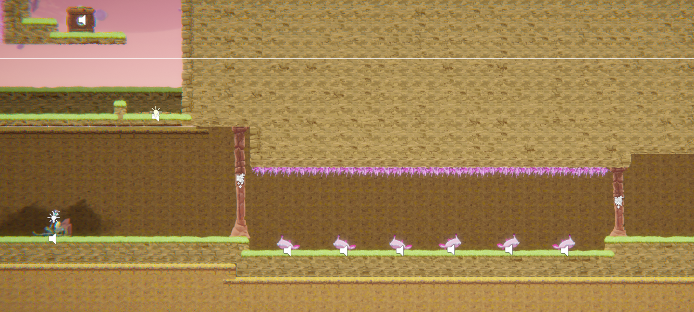


### 1.3. Challenge
The level introduces different challenges to the player as they progress throughout the level as the player is introduced to each new mechanic individually before it is then combined with another mechanic to create a new layer of difficulty for the player. The final area of the level is a combination of all the different mechanics and challenges that the player has been introduced to throughout their time playing the level, this means that the difficulty curve of the level is gradual and that by the time the player reaches the final area of the level they are not overwhelmed by the increase in difficulty. This allows for the player to stay in a constant state of flow where as they progress through the level the difficulty of the challenges they face increase along with the each new mechanic introduced resulting in a gradual increase in difficulty that does not cause the flow to break. By controlling the flow of the level in this way the difficulty curve that the player experiences is never to extreme meaning that each challenge presented to the player feels unique and interesting.

New layer of difficulty added to existing mechanic:

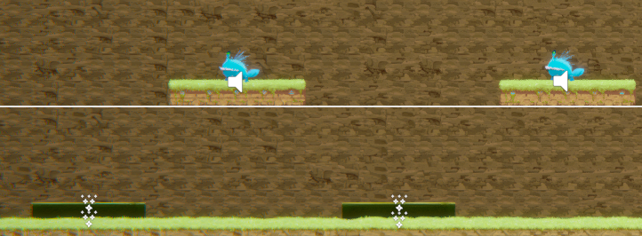

Combination of all mechanics introduced:

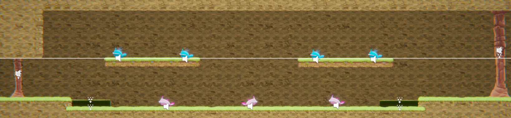


### 1.4. Exploration
The player is encouraged to explore different spaces within the level through player curiosity, as the level has been designed so that the player is rewarded for investigating the different spaces that take their interest, these spaces are made distinct by being placed in ways to where the player can easily skip over them. These spaces are best demonstrated by the gun pickup at the end of section 2 and the health pickups at the start of section 3. As these spaces contain items that are valuable to the player, thus meaning that if players decides to ignore the space with these items the remaining sections of the level will become more difficult. Therefore, player curiosity encourages exploration of these different spaces as by choosing to explore these spaces the player is rewarded with valuable items that make the remaining sections of the level easier. By designing these spaces so that players are rewarded for their exploration distinct areas are created where the player is encouraged to investigate each of these spaces for the valuable rewards given in return.

Gun Pickup:

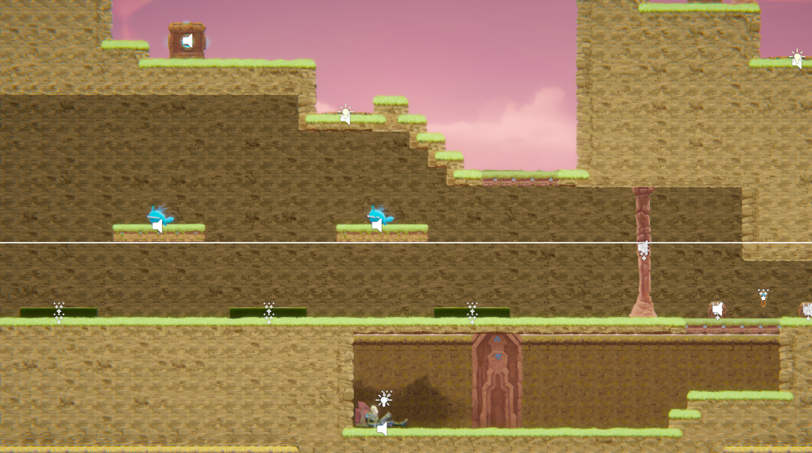

Health Pickup:

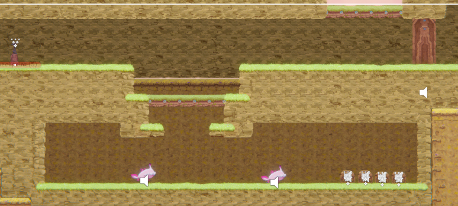


## 2. Core Gameplay (~400 words)
A section on Core Gameplay, where storyboards are used to outline how you introduce the player to each of the required gameplay elements in the first section of the game. Storyboards should follow the format provided in lectures.

Storyboards can be combined when multiple mechanics are introduced within a single encounter. Each section should include a sentence or two to briefly justify why you chose to introduce the mechanic/s to the player in that sequence.

You should restructure the headings below to match the order they appear in your level.

### Storyboard Item Key
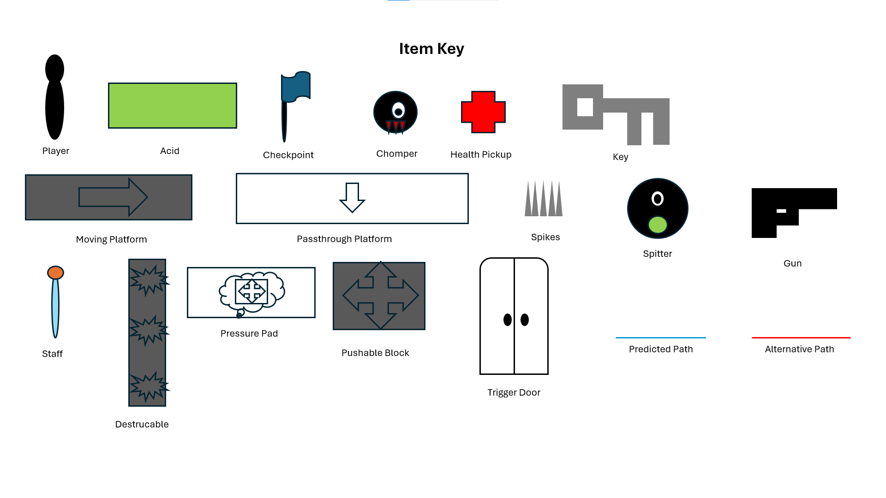

### Spikes
The spikes are introduced to the player as the first encounter in the level as they provide a simple way for the player to be introduced to both damage caused by spikes as well as how much health is lost by hitting them.

### Checkpoints
The checkpoint is introduced to the player before they encounter the acid and moving platform puzzle they will be presented with next so that if they fail to make the jump they will not have to complete the previous section again.

### Acid
The acid is placed towards the start of the first section of the game so that the player can be taught how the acid works, as well as how the checkpoint works if they fall into the acid below.

### Moving Platforms
The moving platform is introduced to enable the player to learn how the moving platform functions as well as how both the checkpoint and acid behave, as failure to make the jump on the moving platform will teach the player about the acid and checkpoint whereas success will teach them about the moving platform.

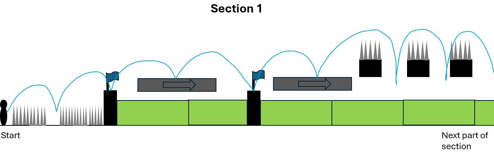

### Passthrough Platforms
The passthrough platform has been placed to encourage the player to explore the environment around them as if they passthrough it they will see the staff that they need to break the pillar and get the key.

### Weapon Pickup (Staff)
The staff has been placed behind a door to encourage the player to explore the environment so that they can acquire it and collect the key blocked by the pillar teaching them about how the staff can break specific sections of the environment.

### Keys
The key has been placed behind the destructible pillar to encourage the player to explore and to solve the puzzle of what they need to do in order to break the pillar and attain the key behind it.

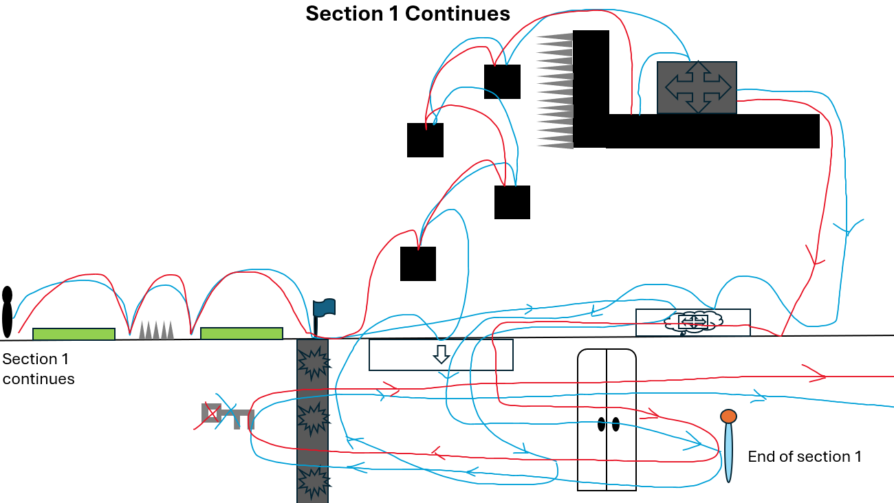

### Chompers
Chompers have been placed in a separate enclosed space to create an encounter where the player learns about the newly acquired staff and how it behaves while also being introduced to the chompers and their behaviours.

### Health Pickups
Health Pickups have been added to the end of the encounter with the chompers to reward the player for their hard work so far as they have overcome many different challenges such as spikes and chompers and their health may be quite low at this point in the level

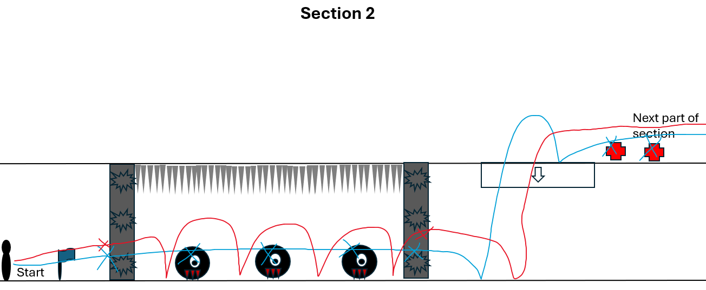

### Spitters
Spitters have been introduced later in the level as they are used to create an addition layer of difficulty to the level by causing the player to need to avoid the acid they spit while also needing to make sure that they don’t accidentally jump into the acid in front of them.

### Weapon Pickup (Gun)
The Gun has been hidden away from the player to encourage exploration as by having the player explore different areas of the level they can then be rewarded for their exploration with an additional weapon.

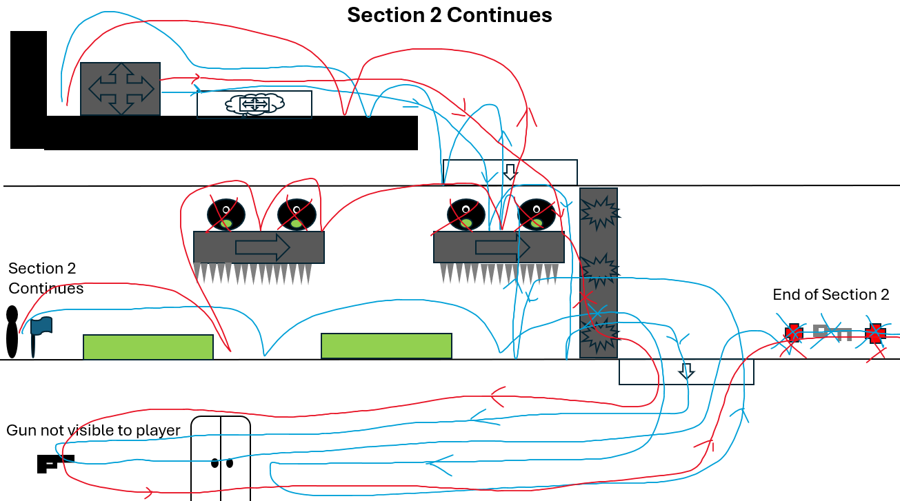

## 3. Spatiotemporal Design
A section on Spatiotemporal Design, which includes your molecule diagram and annotated level maps (one for each main section of your level). These diagrams may be made digitally or by hand, but must not be created from screenshots of your game. The annotated level maps should show the structure you intend to build, included game elements, and the path the player is expected to take through the level. Examples of these diagrams are included in the level design lectures.

No additional words are necessary for this section (any words should only be within your images/diagrams).

### Level Map Item Key

 
### 3.1. Molecule Diagram
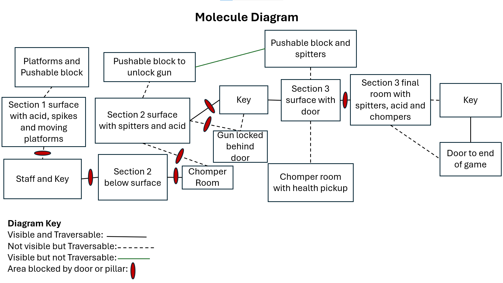
### 3.2. Level Map – Section 1


### 3.3.	Level Map – Section 2


### 3.4.	Level Map – Section 3

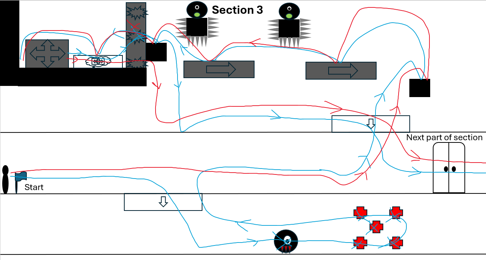
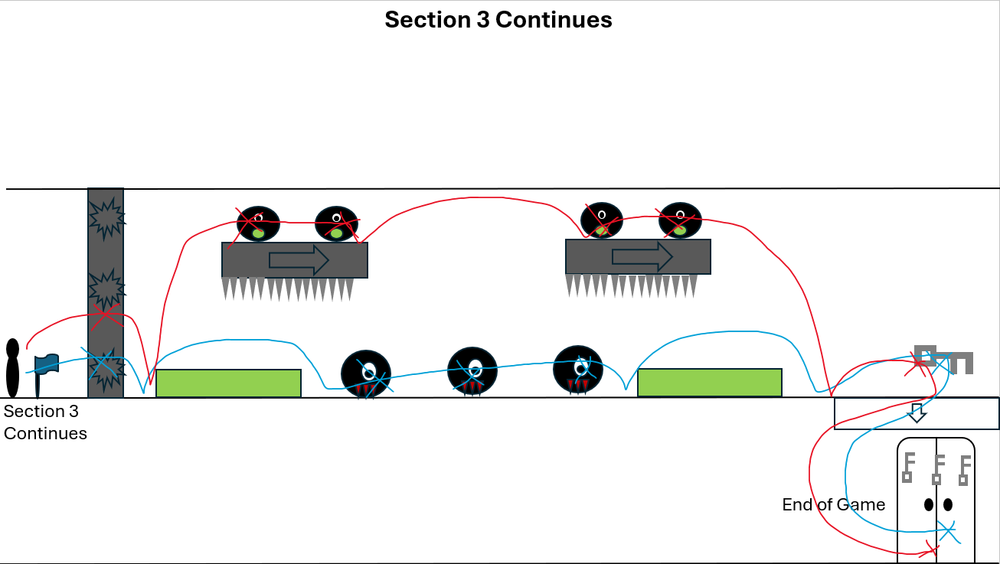

## 4. Iterative Design (~400 words)
Reflect on how iterative design helped to improve your level. Additional prototypes and design artefacts should be included to demonstrate that you followed an iterative design process (e.g. pictures of paper prototypes, early grey-boxed maps, additional storyboards of later gameplay sequences, etc.). You can also use this section to justify design changes made in Unity after you drew your level design maps shown in section 3. 

You should conclude by highlighting a specific example of an encounter, or another aspect of your level design, that could be improved through further iterative design.

Iterative design played a crucial role in the development of the level as the design process allowed for constant feedback to be given on the level which allowed for the quick addition and removal of specific elements within the level. This meant that frequent playtesting allowed for any elements of the game that did not suit a particular section or that felt as if the design goals being targeted were not being met could easily be altered to try and accomplish the desired experience, or even changed entirely to create a different experience that better suited the targeted experience or design goals in mind. An example where the iterative design process allowed for the quick alteration of specific elements within the level that were not meeting the desired experience was during a playtest of the level where the player needed to solve a puzzle, this puzzle involved a pushable block which was needed to unlock the next section of the level. However, when the player pushed the block in the opposite direction to the one desired, it resulted in the player becoming indefinitely stuck within the section where the only way to resolve the issue was to restart the level from the beginning. Therefore, the iterative design process allowed for quick and immediate action to be taken to resolve this issue as the playtest revealed that there was no system in place that prevented the issue from occurring to begin with. This meant that the playtest provided by the iterative design process allowed for a quick alteration to be made where a system was able to be implemented to create the original desired outcome. This system involved placing a small step in the terrain to where the block could no longer be pushed in the opposite direction and cause the player to become indefinitely stuck in the level, this system also meant that if the player did accidentally push the block in the opposite direction to the one desired they would be able to correct their mistake by pushing the block in the desired direction resulting in the puzzle being solved to where the original design goals were met. Some other areas within the level that could benefit from additional iterative design would be areas such as at the start of section 3 where that player must travel from moving platform to moving platform while avoiding the acid from the spitters above. This area could benefit from the iterative design process as it could be used to create an area with a greater dramatic arc by experimenting with possible consequences that the player may face for not making the jump between the platforms resulting in the area having a greater sense of tension.

## Generative AI Use Acknowledgement

N/A
